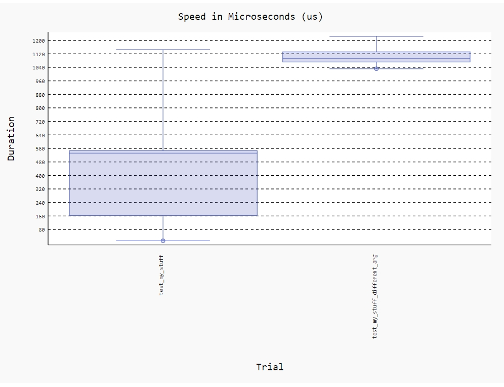
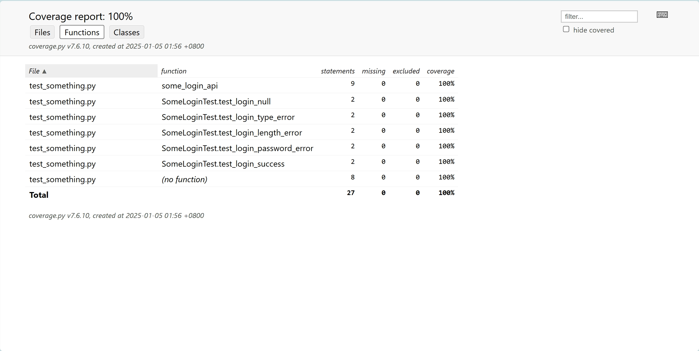

# djangotutorial

> django 官方示例

https://docs.djangoproject.com/zh-hans/5.1/intro/


## 运行应用

```shell
python manage.py runserver
```


## Django测试

应用测试：https://docs.djangoproject.com/zh-hans/5.1/intro/tutorial05/

测试工具：https://docs.djangoproject.com/zh-hans/5.1/topics/testing/

运行所有用例：

```shell
python manage.py test
```

运行polls应用下的所有用例：

```shell
python manage.py test polls
```

运行polls应用下的tests目录用例：

```shell
python manage.py test polls.tests
```

运行polls应用下的test_model.py文件中的 QuestionModelTests 测试类：

```shell
python manage.py test polls.tests.test_model.QuestionModelTests
```

## Django调试工具

* 官方文档：https://django-debug-toolbar.readthedocs.io/

* [安装与使用](./docs/debug_toolbar.md)


## Django性能分析

* 开源地址：https://github.com/jazzband/django-silk

* [安装与使用](./docs/django_silk.md)


## 基准测试

* [查看文档](./docs/benchmark_test.md)



## 覆盖率统计

* [查看文档](./docs/coverage_test.md)



## 缓存框架

https://docs.djangoproject.com/zh-hans/5.1/topics/cache/

django-db-performance

这个库可以帮助你监控 Django 的数据库性能，它会记录查询的执行时间，并报告在基准测试过程中数据库的性能瓶颈
