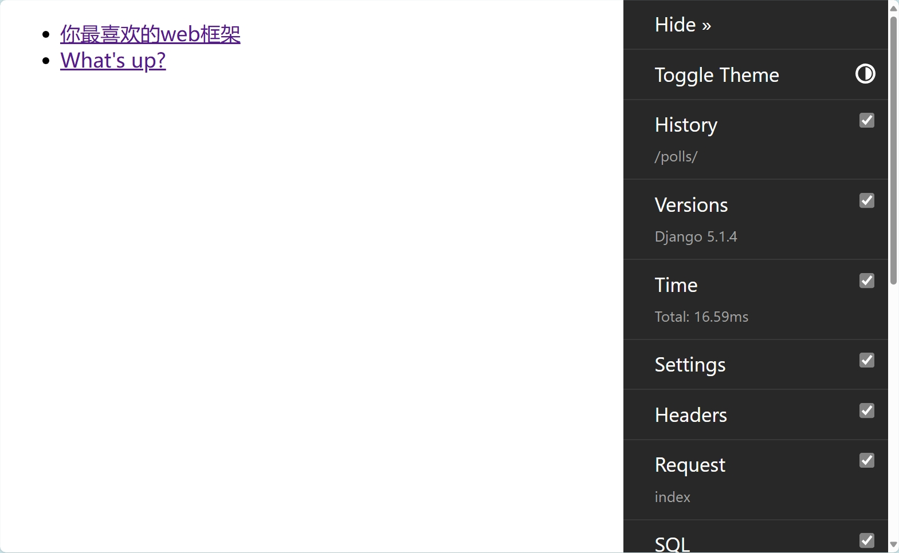

# djangotutorial

> django 官方示例

https://docs.djangoproject.com/zh-hans/5.1/intro/


## 运行应用

```shell
python manage.py runserver
```


## 运行测试

应用测试：https://docs.djangoproject.com/zh-hans/5.1/intro/tutorial05/

测试工具：https://docs.djangoproject.com/zh-hans/5.1/topics/testing/

运行所有用例：

```shell
python manage.py test
```

运行polls应用下的所有用例：

```shell
python manage.py test polls
```

运行polls应用下的tests目录用例：

```shell
python manage.py test polls.tests
```

运行polls应用下的test_model.py文件中的 QuestionModelTests 测试类：

```shell
python manage.py test polls.tests.test_model.QuestionModelTests
```

## Django Debug toolbar

* 官方文档：https://django-debug-toolbar.readthedocs.io/

* [安装与使用](./docs/debug_toolbar.md)



## Django-Silk

* 开源地址：https://github.com/jazzband/django-silk

* [安装与使用](./docs/django_silk.md)


