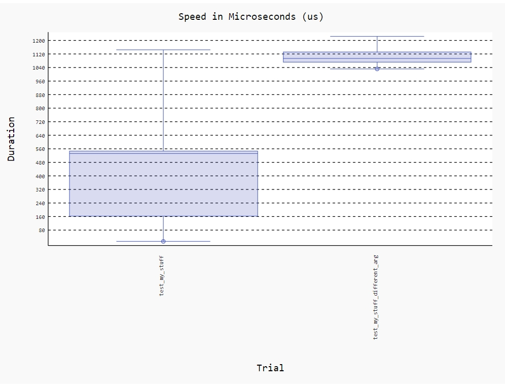

# 基准测试在Web中的应用

## 什么是基准测试？

__基准测试属于性能测试的一种，用于评估和衡量软件的性能指标。我们可以在软件开发的某个阶段通过基准测试建立一个已知的性能水平，称为"基准线"。当系统的软硬件环境发生变化之后再进行一次基准测试以确定那些变化对性能的影响。__ 这是基准测试最常见的用途。

Donald Knuth在1974年出版的《Structured Programming with go to Statements》提到：

> 毫无疑问，对效率的片面追求会导致各种滥用。程序员会浪费大量的时间在非关键程序的速度上，实际上这些尝试提升效率的行为反倒可能产生很大的负面影响，特别是当调试和维护的时候。我们不应该过度纠结于细节的优化，应该说约97%的场景：过早的优化是万恶之源。当然我们也不应该放弃对那关键3%的优化。一个好的程序员不会因为这个比例小就裹足不前，他们会明智地观察和识别哪些是关键的代码；但是仅当关键代码已经被确认的前提下才会进行优化。对于很多程序员来说，判断哪部分是关键的性能瓶颈，是很容易犯经验上的错误的，因此一般应该借助测量工具来证明。

虽然经常被解读为不需要关心性能，但是的少部分情况下（3%）应该观察和识别关键代码并进行优化。

## 为什么要做基准(benchmark)测试？？

虽然 `django-silk` 提供了非常详细的性能分析，包括数据库查询、请求响应时间、视图执行时间等，且能够提供很多深入的性能细节，但它并不专注于 **全面的基准测试**，也缺少 **高精度的性能测量** 和 **负载模拟**，这些是 `pytest-benchmark` 和 `pyperf` 等工具的强项。

- **`django-silk`** 更侧重于 **请求级别** 和 **数据库查询** 的性能分析，它非常适合用于监控和优化 Django 项目的 **运行时性能**。比如，你可以查看每个请求的时间消耗，哪个 SQL 查询慢，视图渲染消耗时间等。这些信息对 **性能瓶颈定位** 很有帮助。

- **`pytest-benchmark` 和 `pyperf`** 则更侧重于 **整体基准测试**，尤其是在 **测量函数执行时间、稳定性和高精度性能数据** 方面。这些工具适合做一些**精确的性能测试**，例如测量某个功能或操作的响应时间，或对某段代码进行微观优化。


## pyperf

Python 模块是一个用于编写、运行和分析基准测试的工具包。

开源项目地址：https://github.com/psf/pyperf

### 特征

* 运行可靠基准测试的简单 API
* 自动校准时间预算的基准。
* 生成多个工作进程。
* 计算平均值和标准差。
* 检测基准测试结果是否不稳定。
* JSON 格式来存储基准测试结果。
* 支持多种单位：秒、字节和整数。

### 安装和使用

__安装__

* pip安装pyperf

```shell
> pip install pyperf
```

__运行__

pyperf 提供两种运行方式。

1. 通过`pyerf timeit`命令执行。

```shell
> pyperf timeit -o bench.json  "from polls.polls_utils.some_code import foo; foo()"
.....
Mean +- std dev: 1.23 sec +- 0.00 sec
```

> 默认情况下，`pyperf timeit` 进行基准测试是串行执行的，即它会一次执行一次指定的代码片段，并多次重复这个过程以收集性能数据。`pyperf timeit` 通过多次调用指定的函数或代码片段，测量其执行时间，并计算统计指标（如均值、标准差等）来评估性能。

2. 编写基准测试脚本运行。

当我们测试比较复杂时，也可以通过脚本编写基准测试。

```python
# test_bencmark.py
import sys
from pathlib import Path

import pyperf

polls_dir = Path(__file__).resolve().parent.parent.parent
sys.path.append(str(polls_dir))

from polls.polls_utils.some_code import foo

runner = pyperf.Runner()

setup = "from polls.polls_utils.some_code import foo"

runner.timeit(name="foo test",
              stmt="foo()",
              setup=setup)
```

运行基准测试脚本：

```shell
> python test_bencmark.py -o bench.json
.....................
foo test: Mean +- std dev: 1.23 sec +- 0.00 sec
```

测试结果会写入`bench.json` 文件。可以使用`pyperf stats`命令分析测试结果。

```shell
> python -m pyperf stats bench.json

Total duration: 1 min 44.3 sec
Start date: 2025-01-02 20:25:34
End date: 2025-01-02 20:27:24
Raw value minimum: 1.23 sec
Raw value maximum: 1.23 sec

Number of calibration run: 1
Number of run with values: 20
Total number of run: 21

Number of warmup per run: 1
Number of value per run: 3
Loop iterations per value: 1
Total number of values: 60

Minimum:         1.23 sec
Median +- MAD:   1.23 sec +- 0.00 sec
Mean +- std dev: 1.23 sec +- 0.00 sec
Maximum:         1.23 sec

  0th percentile: 1.23 sec (-0% of the mean) -- minimum
  5th percentile: 1.23 sec (-0% of the mean)
 25th percentile: 1.23 sec (-0% of the mean) -- Q1
 50th percentile: 1.23 sec (-0% of the mean) -- median
 75th percentile: 1.23 sec (+0% of the mean) -- Q3
 95th percentile: 1.23 sec (+0% of the mean)
100th percentile: 1.23 sec (+0% of the mean) -- maximum

Number of outlier (out of 1.23 sec..1.23 sec): 0
```

__更多参数__


下面是 `pyperf timeit --help` 命令的中文翻译以及对应的 Markdown 表格：

|                   选项                    |                 描述                 |
|:---------------------------------------:|:----------------------------------:|
|              `-h, --help`               |             显示帮助信息并退出              |
|              `--rigorous`               |        花费更长时间运行测试以获得更准确的结果         |
|                `--fast`                 |             快速获得粗略的答案              |
|         `--debug-single-value`          |            调试模式，只计算一个值             |
|  `-p PROCESSES, --processes PROCESSES`  |        用于运行基准测试的进程数（默认：20）         |
|      `-n VALUES, --values VALUES`       |           每个进程的值数（默认：3）            |
|     `-w WARMUPS, --warmups WARMUPS`     |         每次运行跳过的值数，用于预热基准测试         |
|        `-l LOOPS, --loops LOOPS`        |       每个值的循环数，0表示自动校准（默认：0）        |
|             `-v, --verbose`             |               启用详细模式               |
|              `-q, --quiet`              |               启用安静模式               |
|               `--pipe FD`               |       将基准测试编码为 JSON 并写入管道 FD       |
|    `-o FILENAME, --output FILENAME`     |      将结果编码为 JSON 并写入 FILENAME      |
|           `--append FILENAME`           |     将结果编码为 JSON 并追加到 FILENAME      |
|          `--min-time MIN_TIME`          |  单个值的最小持续时间（秒），用于校准循环数（默认：100 毫秒）  |
|           `--timeout TIMEOUT`           |     指定单个基准测试执行的超时时间（秒）（默认：禁用）      |
|               `--worker`                |            工作进程，运行基准测试             |
|         `--worker-task TASK_ID`         |     工作任务的标识符：仅执行基准测试函数 TASK_ID     |
|           `--calibrate-loops`           |               校准循环数                |
|          `--recalibrate-loops`          |              重新校准循环数               |
|          `--calibrate-warmups`          |               校准预热数                |
|         `--recalibrate-warmups`         |              重新校准预热数               |
|              `-d, --dump`               |             显示基准测试运行结果             |
|            `--metadata, -m`             |               显示元数据                |
|              `--hist, -g`               |              显示值的直方图               |
|              `--stats, -t`              |          显示统计信息（最小值、最大值等）          |
|          `--affinity CPU_LIST`          |          指定工作进程的 CPU 亲和性           |
|        `--inherit-environ VARS`         |        工作子进程继承的环境变量的逗号分隔列表         |
|              `--copy-env`               |              复制所有环境变量              |
|              `--no-locale`              |            不复制区域设置环境变量             |
|            `--python PYTHON`            |            Python 可执行文件            |
|        `--compare-to REF_PYTHON`        | 在 REF_PYTHON 和 PYTHON 上运行基准测试并进行比较 |
| `--python-names REF_NAME:CHANGED_NAMED` |     在结果中命名 PYTHON 和 REF_PYTHON     |
|           `--profile PROFILE`           |              收集性能分析数据              |
|            `--hook pystats`             |          使用给定的 pyperf 钩子           |
|             `--tracemalloc`             |       使用 tracemalloc 跟踪内存分配        |
|            `--track-memory`             |            使用线程跟踪内存使用情况            |
|              `--name NAME`              |        基准测试名称（默认：'timeit'）         |
|        `-s SETUP, --setup SETUP`        |                设置语句                |
|          `--teardown TEARDOWN`          |                拆卸语句                |
|       `--inner-loops INNER_LOOPS`       |             每个值的内部循环数              |
|         `--duplicate DUPLICATE`         |           重复语句以减少外部循环的开销           |

示例：

* 调试

```shell
pyperf timeit --debug-single-value -o bench4.json  "from polls.polls_utils.some_code import foo; foo()"
.
1.23 sec
```

* 自定义进程

```shell
> pyperf timeit -p 3 -n 10 -o bench3.json  "from polls.polls_utils.some_code import foo; foo()"
....
Mean +- std dev: 1.23 sec +- 0.00 sec
```

* 显示直方图

```shell
> pyperf timeit -g -o bench2.json  "from polls.polls_utils.some_code import foo; foo()"
.....................
1.23 sec: 4 #############################################
1.23 sec: 1 ###########
1.23 sec: 1 ###########
1.23 sec: 5 ########################################################
1.23 sec: 2 #######################
1.23 sec: 3 ##################################
1.23 sec: 4 #############################################
1.23 sec: 3 ##################################
1.23 sec: 2 #######################
1.23 sec: 2 #######################
1.23 sec: 4 #############################################
1.23 sec: 7 ###############################################################################
1.23 sec: 2 #######################
1.23 sec: 3 ##################################
1.23 sec: 4 #############################################
1.23 sec: 5 ########################################################
1.23 sec: 2 #######################
1.23 sec: 0 |
1.23 sec: 2 #######################
1.23 sec: 3 ##################################
1.23 sec: 1 ###########

Mean +- std dev: 1.23 sec +- 0.00 sec
```

* 显示测试结果

```shell
pyperf timeit --dump  "from polls.polls_utils.some_code import foo; foo()"
.....................
Run 1: calibrate the number of loops: 1
- calibrate 1: 1.23 sec (loops: 1, raw: 1.23 sec)
- calibrate 2: 1.23 sec (loops: 1, raw: 1.23 sec)
- calibrate 3: 1.23 sec (loops: 1, raw: 1.23 sec)
- calibrate 4: 1.23 sec (loops: 1, raw: 1.23 sec)
Run 2: 1 warmup, 3 values, 1 loop
- warmup 1: 1.23 sec
- value 1: 1.23 sec
- value 2: 1.23 sec
- value 3: 1.23 sec
...

Mean +- std dev: 1.23 sec +- 0.00 sec
```

## pytest-benchmark

项目地址：https://github.com/ionelmc/pytest-benchmark

pytest-benchmark 是 pytest单元测试框架的一个插件。

### 安装和使用

__安装__

* pip安装pyperf

```shell
> pip install pytest
> pip install pytest-benchmark
```

__使用__

编写基准测试用例。

```python
import sys
from pathlib import Path

polls_dir = Path(__file__).resolve().parent.parent
sys.path.append(str(polls_dir))

from polls.polls_utils.some_code import foo


def test_my_stuff(benchmark):
    # benchmark foo
    result = benchmark(foo)
    assert result == 123


def test_my_stuff_different_arg(benchmark):
    # benchmark foo, but add some arguments
    result = benchmark(foo, 0.001)
    assert result == 123
```

运行测试

```shell
pytest test_benchmark2.py
```


### 更多用法

__命令行参数__

以下是根据文中内容整理的关于命令行参数的表格：

以下是根据文中内容整理的关于命令行参数的表格：

|                     参数                     |                                                                                       说明                                                                                       |                                   默认值                                    |
|:------------------------------------------:|:------------------------------------------------------------------------------------------------------------------------------------------------------------------------------:|:------------------------------------------------------------------------:|
|        --benchmark-min-time=SECONDS        |                                                                                  每轮测试的最小时间（秒）                                                                                  |                                ‘0.000005’                                |
|        --benchmark-max-time=SECONDS        |                                                     每个测试的最大运行时间，会重复测试直到达到总时间。如果测试函数非常慢或–benchmark-min-rounds很大，则可能会超过此时间。                                                      |                                  ‘1.0’                                   |
|         --benchmark-min-rounds=NUM         |                                                                       最小测试轮数，即使总时间会超过–benchmark-max-time                                                                       |                                    5                                     |
|           --benchmark-timer=FUNC           |                                                                                  测量时间时使用的计时器                                                                                   |                           ‘time.perf_counter’                            |
|   --benchmark-calibration-precision=NUM    |                                                                  校准迭代次数时使用的精度。精度为10会使计时器看起来精确10倍，但偏差测量的精度会降低。                                                                  |                                    10                                    |
|         --benchmark-warmup=[KIND]          |                                激活预热。在校准阶段运行测试函数，直到达到指定的次数。参见–benchmark-warmup-iterations。注意：预热阶段也遵守–benchmark-max-time。可选值：‘auto’, ‘off’, ‘on’。                                |                            ‘auto’（在PyPy上自动激活）                            |
|     --benchmark-warmup-iterations=NUM      |                                                                                 预热阶段运行的最大迭代次数                                                                                  |                                  100000                                  |
|           --benchmark-disable-gc           |                                                                                 在基准测试期间禁用垃圾回收                                                                                  |                                                                          |
|              --benchmark-skip              |                                                                                 跳过包含基准测试的任何测试                                                                                  |                                                                          |
|            --benchmark-disable             |                                                                         禁用基准测试。基准测试函数只运行一次，并且不报告统计信息。                                                                          |                                                                          |
|             --benchmark-enable             |                                                            强制启用基准测试。使用此选项可以覆盖–benchmark-disable（如果您在pytest配置中设置了它）。                                                            |                                                                          |
|              --benchmark-only              |                                                                          仅运行基准测试。这会覆盖–benchmark-skip。                                                                          |                                                                          |
|           --benchmark-save=NAME            |                                                                   将当前运行保存到‘STORAGE-PATH/counter-NAME.json’。                                                                    |                   ‘<commitid>_<date>_<time>_<isdirty>’                   |
|            --benchmark-autosave            |                                                     自动将当前运行保存到‘STORAGE-PATH/<counter>_<commitid>_<date>_<time>_<isdirty>’。                                                     |                                                                          |
|           --benchmark-save-data            |                                                            使–benchmark-save和–benchmark-autosave包括所有计时数据，而不仅仅是统计信息。                                                             |                                                                          |
|           --benchmark-json=PATH            |                                                                 将JSON报告转储到PATH。注意，这将包括完整的数据（所有计时数据，而不仅仅是统计信息）。                                                                 |                                                                          |
|          –benchmark-compare=[NUM           |                                                                                      _ID]                                                                                      |           将当前运行与运行NUM（或elasticsearch中_id的前缀）或未指定时的最新保存的运行进行比较。           |  |
|   –benchmark-compare-fail=EXPR [EXPR …]    |                                                            如果性能根据给定的EXPR退化，则测试失败（例如：min:5%或mean:0.001表示秒数）。可以多次使用。                                                             |                                                                          |
|        --benchmark-cprofile=COLUMN         |                      如果指定，将启用cProfile。将为给定列存储顶部函数。可用列：‘ncalls_recursion’, ‘ncalls’, ‘tottime’, ‘tottime_per’, ‘cumtime’, ‘cumtime_per’, ‘function_name’。                       |                                                                          |
|      --benchmark-cprofile-loops=LOOPS      |                                                                       在cprofile中运行函数的次数。可用选项：‘auto’或整数。                                                                        |                                                                          |
|       --benchmark-cprofile-top=COUNT       |                                                                                    要显示的行数。                                                                                     |                                                                          |
| –benchmark-cprofile-dump=[FILENAME-PREFIX] |                                                将cprofile转储保存为FILENAME-PREFIX-test_name.prof。如果FILENAME-PREFIX包含斜杠（‘/’），则会创建目录。                                                 |                       ‘benchmark_20241028_160327’                        |
|        --benchmark-time-unit=COLUMN        |                                                                     将结果缩放到的单位。可用单位：‘ns’, ‘us’, ‘ms’, ‘s’。                                                                      |                                  ‘auto’                                  |
|          --benchmark-storage=URI           | 指定存储运行的路径作为uri，形式为file://path或elasticsearch+http[s]://host1,host2/[index/doctype?project_name=Project]（当使用–benchmark-save或–benchmark-autosave时）。为了向后兼容，意外值将被转换为file://<value>。 |                          ‘file://./.benchmarks’                          |
|     –benchmark-netrc=[BENCHMARK_NETRC]     |                                                                           从netrc文件加载elasticsearch凭据。                                                                           |                                    ‘’                                    |
|            --benchmark-verbose             |                                                                                   转储诊断和进度信息。                                                                                   |                                                                          |
|             --benchmark-quiet              |                                                                                  禁用报告。详细模式优先。                                                                                  |                                                                          |
|            --benchmark-sort=COL            |                                                       要排序的列。可以是以下之一：‘min’, ‘max’, ‘mean’, ‘stddev’, ‘name’, ‘fullname’。                                                        |                                  ‘min’                                   |
|         --benchmark-group-by=LABEL         |                           如何对测试进行分组。可以是以下之一：‘group’, ‘name’, ‘fullname’, ‘func’, ‘fullfunc’, ‘param’或‘param:NAME’，其中NAME是传递给@pytest.parametrize的名称。                            |                                 ‘group’                                  |
|         --benchmark-columns=LABELS         |                                                                               结果表中要显示的列的逗号分隔列表。                                                                                | ‘min, max, mean, stddev, median, iqr, outliers, ops, rounds, iterations’ |
|          --benchmark-name=FORMAT           |                                                             结果中名称的格式。可以是以下之一：‘short’, ‘normal’, ‘long’, 或‘trial’。                                                              |                                 ‘normal’                                 |
|  --benchmark-histogram=[FILENAME-PREFIX]   |                                          在FILENAME-PREFIX-test_name.svg中绘制随时间变化的最小值/最大值/平均值/标准差的图形。如果FILENAME-PREFIX包含斜杠（‘/’），则会创建目录。                                          |                        ‘benchmark_<date>_<time>’                         |

__生成基准测试图片__

1.安装依赖

```shell
pip install pygal
pip install pygaljs
```

2.运行测试跟`--benchmark-histogram`参数

```shell
pytest test_benchmark2.py --benchmark-histogram
```

3.查看生成图片




__类方法进行基准测试__

1.安装依赖

```shell
pip install aspectlib 
```

2.运行测试用例

```python
import sys
from pathlib import Path

polls_dir = Path(__file__).resolve().parent.parent
sys.path.append(str(polls_dir))

from polls.polls_utils.some_code import MyClass


def test_class_method(benchmark):
    benchmark.weave(MyClass.bar, lazy=True)
    mc = MyClass()
    mc.bar()
```

__使用markers__

你可以用基准`markers`设置每个测试的选项：

```python
import time
import pytest

@pytest.mark.benchmark(
    group="group-name",
    min_time=0.1,
    max_time=0.5,
    min_rounds=5,
    timer=time.time,
    disable_gc=True,
    warmup=False
)
def test_my_stuff(benchmark):
    @benchmark
    def result():
        # Code to be measured
        return time.sleep(0.000001)

    # Extra code, to verify that the run
    # completed correctly.
    # Note: this code is not measured.
    assert result is None
```

