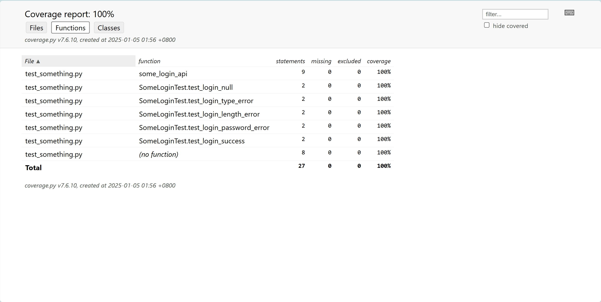

# 代码覆盖率

代码覆盖度表示有多少源代码被测试了。它表明了代码的哪些部分被测试用例覆盖，哪些没有。这是测试应用很重要的部分，所以强烈推荐检查测试用例的覆盖度。

## Coverage

官方文档：https://coverage.readthedocs.io/en/7.6.10/index.html

`coverage.py`是一个测量Python程序代码覆盖率的工具。它监视你的程序，注意代码的哪些部分已被执行，然后分析源代码以识别可能已执行但未执行的代码。

### 安装

1.pip安装coverage.py

```shell
pip install coverage
```

### 快速了解使用

1.编写一个简单的示例，理解覆盖率的使用。

```python
import unittest


def some_login_api(username: str = None, password:str = None):
    """
    某登录API验证逻辑
    """
    if username is None or password is None:
        return "username or password is null"
    elif isinstance(username, str) is False or isinstance(password, str) is False:
        return "username or password type error"
    elif len(username) < 6:
        return "username length error"
    elif password.startswith("abc") or password.startswith("123"):
        return "password too easy"
    else:
        return "login success"


class SomeLoginTest(unittest.TestCase):

    def test_login_null(self):
        ret = some_login_api()
        self.assertEqual(ret, "username or password is null")
```
> 根据`some_login_api()`函数的逻辑，SomeLoginTest测试类中的代码只有一条用例肯定是覆盖率不全的。

2.使用`coverage run`来运行测试套件并收集数据。无论通常如何运行你的测试套件，都可以在覆盖下使用的测试运行器。

```shell
pytest

or 

python -m unittest discover
```
> 注：pytest 可以执行unittest编写的用例。

将上面的命令替换为 `coverage run`命令。

```shell
coverage run -m pytest

or 

coverage run -m unittest discover
```

3.使用 `coverage report`去报告结果：

```shell
coverage report -m
Name                Stmts   Miss  Cover   Missing
-------------------------------------------------
__init__.py             0      0   100%
test_something.py      15      7    53%   10-17
-------------------------------------------------
TOTAL                  15      7    53%
```

4.进一步补充测试用例，提高覆盖率

```python
import unittest

def some_login_api(username: str = None, password:str = None):
    ...


class SomeLoginTest(unittest.TestCase):

    def test_login_null(self):
        ret = some_login_api()
        self.assertEqual(ret, "username or password is null")

    def test_login_type_error(self):
        ret = some_login_api("administrator", 97843580134958)
        self.assertEqual(ret, "username or password type error")

    def test_login_length_error(self):
        ret = some_login_api("admin", "admin123")
        self.assertEqual(ret, "username length error")

    def test_login_password_error(self):
        ret = some_login_api("abcxyz", "123456")
        self.assertEqual(ret, "password too easy")

    def test_login_success(self):
        ret = some_login_api("administrator", "admin123456")
        self.assertEqual(ret, "login success")
```

重新运行测试，并统计覆盖率

```shell
> coverage run -m unittest discover  # 运行测试
.....
----------------------------------------------------------------------
Ran 5 tests in 0.001s

OK


> coverage report -m   # 统计覆盖率
Name                Stmts   Miss  Cover   Missing
-------------------------------------------------
test_something.py      27      0   100%
-------------------------------------------------
TOTAL                  27      0   100%
```

### HTML报告

为了更好的展示，使用`coverage html`来获得详细说明遗漏行的带注释的html清单：

```shell
> coverage html

Wrote HTML report to htmlcov\index.html
```



### Coverage.py能力

Coverage.py可以做很多事情：
* 默认情况下，它将测量行（语句）覆盖率。
* 它还可以衡量分支的覆盖率。 
* 它可以告诉您哪些测试运行了哪些行。 
* 它可以生成多种格式的报告：文本、HTML、XML、LCOV和JSON。 
* 对于高级用途，有一个API，结果数据在SQLite数据库中可用。

#### 分支覆盖率测量

分支覆盖是一种代码覆盖率的度量方式，它关注代码中的控制结构（如 if 语句、for 循环等），并检查每个分支是否都被执行过。分支覆盖可以帮助你发现代码中未测试到的逻辑路径。

__什么是分支覆盖？__

在代码中，控制结构（如 if 语句、for 循环、while 循环等）会创建多个执行路径。每个控制结构至少有两个分支：一个是条件为真时的路径，另一个是条件为假时的路径。分支覆盖的目标是确保每个分支都被至少执行一次。

* 示例：

```python
def check_number(x):
    if x > 0:
        return "Positive"
    elif x < 0:
        return "Negative"
    else:
        return "Zero"

import unittest

class TestCheckNumber(unittest.TestCase):
    def test_positive(self):
        result = check_number(10)
        self.assertEqual(result, "Positive")

    def test_negative(self):
        result = check_number(-5)
        self.assertEqual(result, "Negative")

    def test_zero(self):
        result = check_number(0)
        self.assertEqual(result, "Zero")

if __name__ == "__main__":
    unittest.main()
```
为了覆盖所有分支，我们需要编写多个测试用例，确保每个条件（x > 0、x < 0 和 x == 0）都被测试到。

* test_positive：测试 x > 0 的情况，确保返回 "Positive"。
* test_negative：测试 x < 0 的情况，确保返回 "Negative"。
* test_zero：测试 x == 0 的情况，确保返回 "Zero"。

通过这三个测试用例，可以完全覆盖 check_number 函数的所有分支。

* 运行测试

当你加上 `--branch` 参数时，Coverage.py 会同时测量行覆盖率和分支覆盖率。它会检查每个分支（如 if 语句的两个分支）是否都被执行过。

```shell
$ coverage run --branch test_branch.py
...

$ coverage report -m
Name             Stmts   Miss Branch BrPart  Cover   Missing
------------------------------------------------------------
test_branch.py      19      0      6      1    96%   26->exit
------------------------------------------------------------
TOTAL               19      0      6      1    96%
```
* Stmts：代码的总行数。
* Miss：未执行的行数。
* Branch：分支的总数。
* BrPart：未完全覆盖的分支数。
* Cover：综合覆盖率（包括行覆盖和分支覆盖）。

#### 命令行使用

Coverage.py有很多子命令：

* run - 运行Python程序并收集执行数据。
* combine - 将多个数据文件组合在一起。
* erase - 擦除先前收集的覆盖率数据。
* report - 报告覆盖结果。
* html - 产生带注释的html列表与覆盖率的结果。
* xml - 生成包含覆盖率结果的xml报告。
* json - 生成包含覆盖率结果的json报告。
* lcov - 生成包含覆盖率结果的lcov报告。
* annotate - 用覆盖结果注释源文件。
* debug - 获取诊断信息。

__示例__

通过使用run命令运行Python程序来收集执行数据：

```shell
coverage run test_branch.py
```

你可以使用`-m`开关并指定一个可导入的模块名，而不是提供文件名，

```shell
coverage run -m dir_one.test_branch 
```
你可以使用 `--source`、`--include` 和`--omit`开关指定要度量的代码。

```shell
coverage run --source=one_dir,two_dir -m unittest discover
```

测试套件在不同的条件下运行会生成不同的覆盖率数据。可以收集每次测试运行的覆盖率数据，并且然后将所有单独的数据文件合并到一个组合文件中进行报告。

```shell
coverage combine

coverage combine .\dir_one\.coverage  .\dir_two\.coverage
```

要擦除收集的数据，请使用 erase 命令：

```shell
coverage erase
coverage erase --data-file=.coverage
```

覆盖范围摘要：coverage report

```shell
coverage report
coverage report -m my_program.py my_other_module.py
```

HTML 报告：coverage html

```shell
coverage html
coverage html -d coverage_html # 该参数指定一个输出目录，默认为 “htmlcov”：-d
```

XML 报告：coverage xml

```shell
coverage xml
```

JSON 报告：coverage json

```shell
coverage json
```

LCOV 报告：coverage lcov

```shell
coverage lcov
```

文本注释：coverage annotate

```shell

```

#### coverage 工作原理

对于 coverage.py 的高级使用，或者仅仅是因为你出于好奇，了解其背后的运作机制会有所帮助。

Coverage.py 的工作分为三个阶段：

- **执行**：Coverage.py 运行你的代码，并监控哪些行被执行了。
- **分析**：Coverage.py 检查你的代码，以确定哪些行本可以运行。
- **报告**：Coverage.py 将执行和分析的结果结合起来，生成一个覆盖率数字以及缺失执行的指示。

执行阶段由 `coverage run` 命令处理。分析和报告阶段由报告命令如 `coverage report` 或 `coverage html` 处理。

简而言之，coverage.py 测量哪些行被执行了。但它收集的信息不止于此。它可以测量哪些分支被采取了，如果你启用了上下文，对于每一行或分支，它还会测量它们在哪些上下文中被执行。

让我们更详细地看看每个阶段。

* __执行__

执行阶段的核心是一个追踪函数。这是一个 Python 解释器为程序中执行的每一行调用的函数。Coverage.py 实现了一个追踪函数，它记录每一行执行时的文件和行号。

关于追踪函数的更多细节，可以查看 Python 文档中的 sys.settrace，或者如果你足够勇敢，可以查看 C 追踪函数的工作原理。

为程序中的每一行执行一个函数会使执行变得非常缓慢。Coverage.py 的追踪函数用 C 语言实现，以减少这种开销。它还确保不追踪你感兴趣的代码之外的部分。

在测量分支覆盖率时，使用相同的追踪函数，但不是记录行号，而是记录行号对。每次调用追踪函数时，它会记住行号，然后下一次调用记录对（prev, this），以表示执行从上一行过渡到这一行。在内部，这些被称为弧。

在收集数据时，coverage.py 将数据写入一个文件，通常名为 `.coverage`。这是一个包含所有测量数据的 SQLite 数据库。

* __插件__

当然，coverage.py 主要测量 Python 文件的执行。但它也可以用于分析其他类型的执行。文件追踪器插件提供了对非 Python 文件的支持。例如，Django HTML 模板最终会在某处执行 Python 代码，但作为开发人员，你希望将这种执行映射回你的 .html 模板文件。

在执行过程中，遇到的每个新 Python 文件都会提供给插件考虑。插件可以声称该文件，然后将运行时的 Python 执行转换为源级数据以记录。

* __动态上下文__

使用动态上下文时，存在一个当前动态上下文，它在执行过程中会发生变化。它最初是空的。当它为空时，每次进入新函数时，都会检查动态上下文是否应该改变。当当前动态上下文非空时，会跳过检查，直到启动上下文的函数返回。

* __分析__

在你的程序执行并记录行号之后，coverage.py 需要确定哪些行本可以执行。幸运的是，编译后的 Python 文件（.pyc 文件）包含一个行号表。Coverage.py 读取这个表以获取可执行行的集合，还会进行一些额外的源代码分析，以排除像文档字符串之类的内容。

从数据文件中读取已执行的行集合。可执行行与已执行行之间的差集就是未执行的行。

对于分支测量，同样的原则适用，但确定可能分支的过程更为复杂。Coverage.py 使用 Python 源文件的抽象语法树来确定可能的分支集合。

* __报告__

一旦我们有了已执行行和缺失行的集合，报告就是以有用的方式格式化这些信息。每种报告方法（文本、HTML、JSON、注释源代码、XML）都有不同的输出格式，但过程相同：以特定格式写出信息，可能还会包括源代码本身。

## django 中使用 Coverage


要使用标准测试设置运行 Django 测试套件的覆盖率：

1.运行之前编写的django测试

```shell
coverage run manage.py test polls
Found 25 test(s).
Creating test database for alias 'default'...
System check identified no issues (0 silenced).
.....................
DevTools listening on ws://127.0.0.1:5260/devtools/browser/68bef940-a12f-46c7-a868-4e16dcadb755
[31084:13372:0105/015028.956:ERROR:edge_qqbrowser_importer_utils_win.cc(190)] QQBrowser profile preference file doesn't exist
[31084:17956:0105/015030.569:ERROR:fallback_task_provider.cc(126)] Every renderer should have at least one task provided by a primary task provider. If a "Renderer" fallback task is shown, it is a bug. If you have repro steps, please file a new bug and tag it as a dependency of crbug.com/739782.
....[05/Jan/2025 01:50:35,841] - Broken pipe from ('127.0.0.1', 5284)
[05/Jan/2025 01:50:35,841] - Broken pipe from ('127.0.0.1', 5281)
[05/Jan/2025 01:50:35,841] - Broken pipe from ('127.0.0.1', 5282)

----------------------------------------------------------------------
Ran 25 tests in 21.786s

OK
Destroying test database for alias 'default'...
```

2.生成覆盖率结果

```shell
coverage report -m
Name                               Stmts   Miss  Cover   Missing
----------------------------------------------------------------
manage.py                             11      2    82%   12-13
mysite\__init__.py                     0      0   100%
mysite\settings.py                    27      0   100%
mysite\urls.py                         5      0   100%
polls\__init__.py                      0      0   100%
polls\admin.py                         4      0   100%
polls\apps.py                          4      0   100%
polls\migrations\0001_initial.py       6      0   100%
polls\migrations\__init__.py           0      0   100%
polls\models.py                       17      2    88%   12, 28
polls\polls_utils\__init__.py          0      0   100%
polls\polls_utils\some_code.py         9      0   100%
polls\tests\__init__.py                0      0   100%
polls\tests\common.py                  8      0   100%
polls\tests\test_model.py             57      0   100%
polls\tests\test_template.py          48      0   100%
polls\tests\test_view.py              68      0   100%
polls\urls.py                          4      0   100%
polls\views.py                        37      0   100%
----------------------------------------------------------------
TOTAL                                305      4    99%
```
