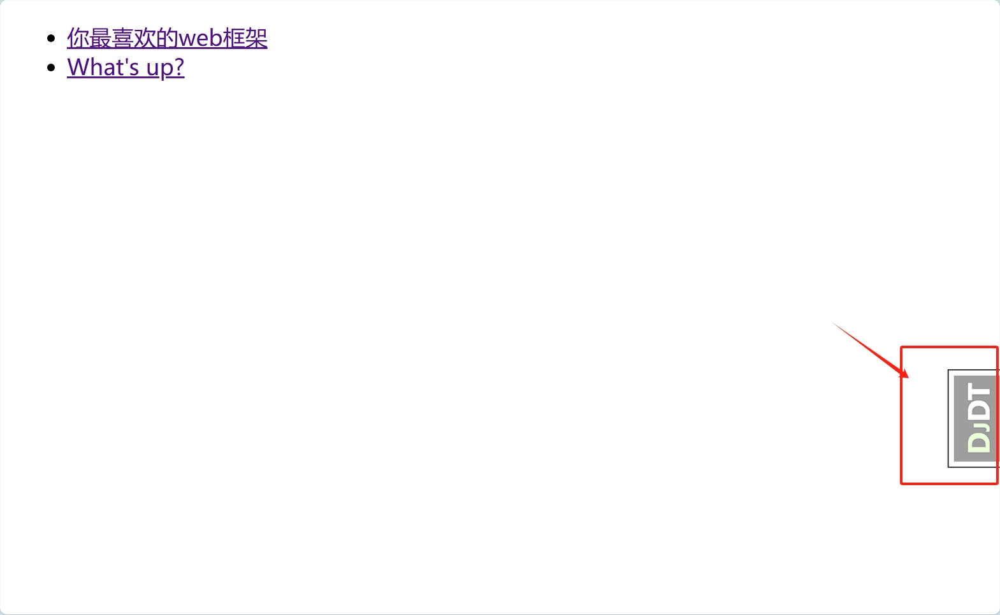
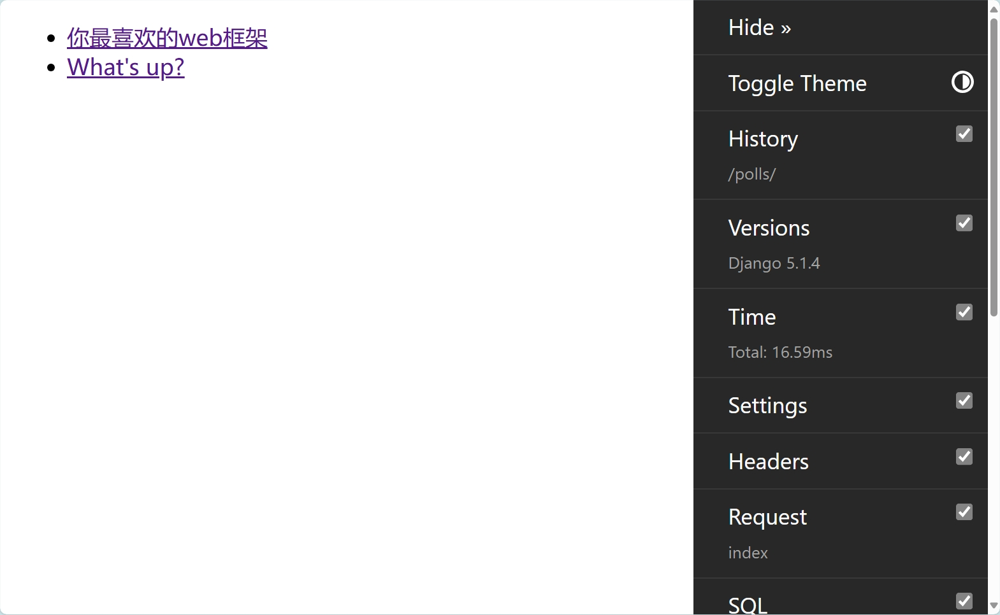
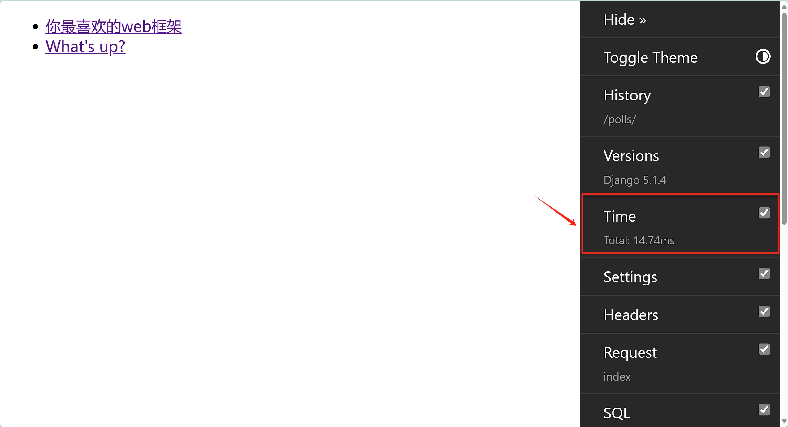
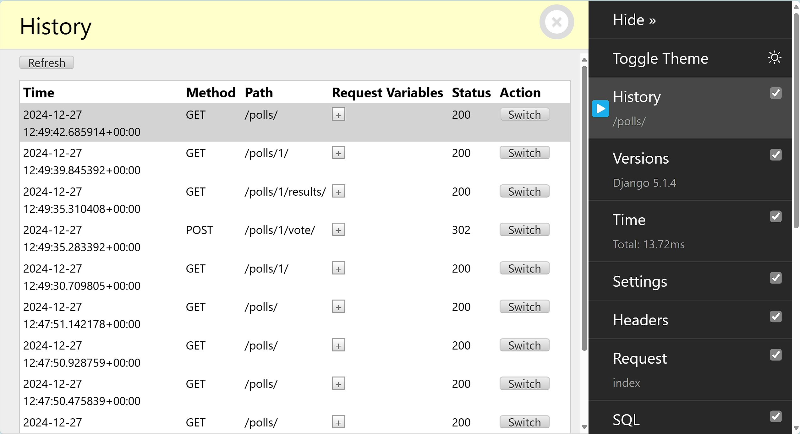
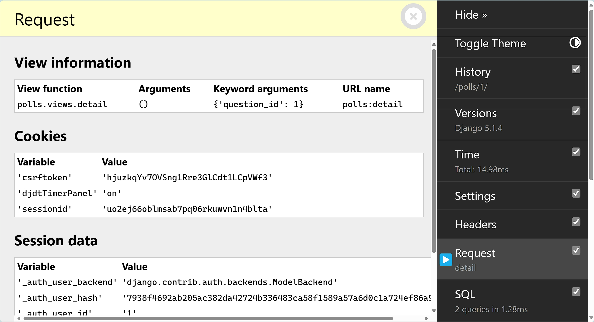
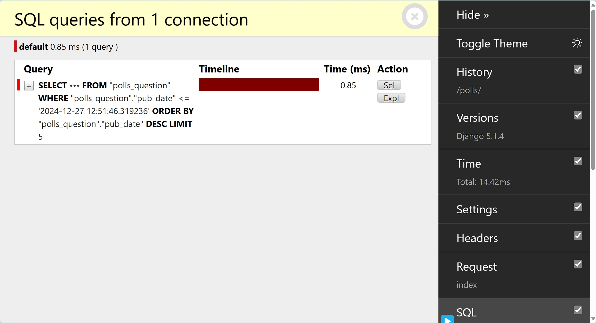

# django debug tools

Django Debug Toolbar是一个调试Django web应用程序的有用工具。工具栏帮助您了解应用程序的功能并识别问题。它通过提供提供有关当前请求和响应的调试信息的面板来实现这一点。

> 我们也可以用他来做部分性能分析，分析请求的性能，以及SQL的性能。

## 安装与配置

参考：https://django-debug-toolbar.readthedocs.io/en/latest/installation.html

1.通过`pip`安装：

```shell
pip install django-debug-toolbar
```

2.添加安装应用

在`settings.py`文件中配置`INSTALLED_APPS`:

```shell

INSTALLED_APPS = [
    # ...
    "debug_toolbar",
    # ...
]
```

3.添加`URLs`

添加`django-debug-toolbar` URLs 到项目的URLconf，即：`mysite/urls.py`文件

```python
# ...
from debug_toolbar.toolbar import debug_toolbar_urls

urlpatterns = [
    # ...
] + debug_toolbar_urls()
```

4.添加中间件

Debug Toolbar主要的中间件中实现，在`settings.py`文件中配置`MIDDLEWARE`:

```python
MIDDLEWARE = [
    # ...
    "debug_toolbar.middleware.DebugToolbarMiddleware",
    # ...
]
```

5.配置内部IP

只有当你的IP地址在Django的INTERNAL_IPS设置中列出时，Debug toolbar 才会显示。对于本地开发，必须将`127.0.0.1`添加到`INTERNAL_IPS`。在`settings.py`文件中配置`INTERNAL_IPS`:

```python
INTERNAL_IPS = [
    # ...
    "127.0.0.1",
    # ...
]
```

完成以上5步，就可以在项目中愉快的使用 Debug Toolbar 了。

## 使用

访问django应用任意页面，右侧显示`DjDT`按钮。



点击`DjDT`按钮显示 Debug toolbar 工具列表



🚨问题：【DjDT在】部分页面无法显示的问题。

view视图返回的页面一定要包含`<body></body>`标签，例如`results.html`页面:

```html
<body> 
<h1>{{ question.question_text }}</h1>

<ul>

    <li>{{ choice.choice_text }} -- {{ choice.votes }} vote{{ choice.votes|pluralize }}</li>

</ul>

<a href="">Vote again?</a>

</body>
```

## 分析

* 查看页面的响应。




* 查看历史URL请求。



* 查看请求信息。



* 查看SQL。



