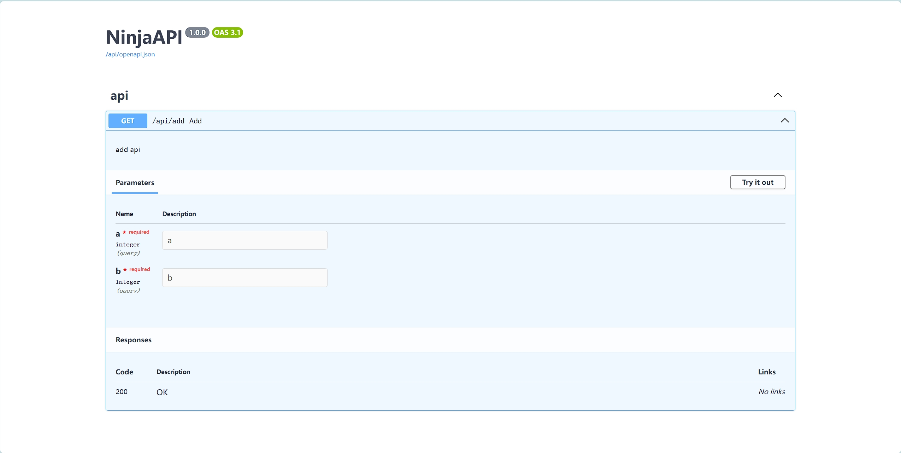

# 开发API

django的定位是Web框架，他包含了太多东西。

* ORM
* 单元测试
* 自带用户、分组管理
* admin管理后台
* 模板语言
* 表单
* ...

你可以完全使用django去完整一个网站的开发。但是，现在的大部分项目都进行了前后端分离，Web框架仅仅用于API开发，那么Django里面的模板语言、表单功能基本上无用了。仅仅作为API开发框架，Django并不是最高效。
于是，在django框架的基础上，出现了更加专注于API开发的框架，例如`django-rest-framework`, `django-ninja`等。

## django-ninja

官网：https://django-ninja.dev/

__主要特点:__

* 简单易懂: 设计为易于使用和符合直觉。
* 快速执行: 多亏了 Pydantic 和 异步支持，具有非常高的性能。
* 快速编程: Django Ninja 是一个用于使用 Django 和 Python 3.6+ 类型提示构建 API 的网络框架。
* 基于标准: 基于标准: OpenAPI (以前称为 Swagger) 和 JSON 模式。
* 对 Django 友好: （显然）与 Django 核心和对象关系映射有良好的集成。
* 可用于生产: 被多家公司用于实际项目。

### 安装

* 支持 pip 安装。

```shell
pip instal django-ninja
```

### 配置

我们可以在全新的django项目中使用django-ninja，也可以在已有的项目中引入他，总之，都非常简单。

1. 创建一个新的app

    ```shell
    python manage.py startapp apis
    ```

2. 将`apis\views.py`更名为`apis\api.py`，实现一个add接口。

    ```python
    from ninja import Router
    
    
    router = Router(tags=["api"])
    
    
    @router.get('/add')
    def add(request, a: int, b: int):
        """
        add api
        """
        return {"result": a + b}
    ```

3. 在`mysite`目录下创建`api.py`文件, 配置NinjaAPI。

    ```python
    from ninja import NinjaAPI
    from apis.api import router as apis_router
    
    api = NinjaAPI()
    
    api.add_router("/", apis_router)
    ```

4. 修改`mysite`目录下面的`urls.py`文件。
    ```python
    from django.contrib import admin
    from django.urls import path, include
    from mysite.api import api
    
    urlpatterns = [
        # admin manager
        path('admin/', admin.site.urls),
        # polls app
        path("polls/", include("polls.urls")),
        # api
        path("api/", api.urls)  # <-- 新增
    ]
    ```
5. 启动django项目，并访问：http://127.0.0.1:8000/api/docs



一个接口就开发完了，接下来，我们仅仅需要专注于 api的开发。
