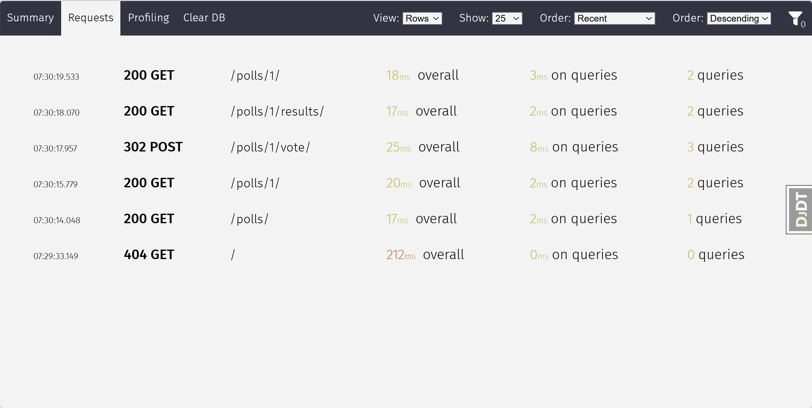
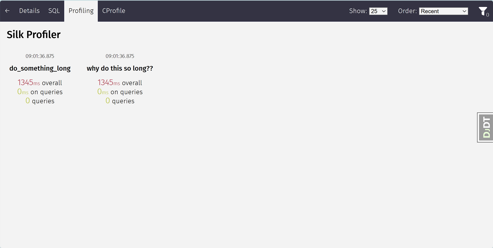

Silk是Django框架的实时分析和检查工具。Silk拦截并存储HTTP请求和数据库查询，然后将它们呈现在用户界面中以供进一步检查。

项目地址:https://github.com/jazzband/django-silk

## 安装与配置

1.通过`pip`安装：

```shell
pip install django-silk
```

2.添加安装应用

在`settings.py`文件中配置`INSTALLED_APPS`:

```shell
MIDDLEWARE = [
    ...
    'silk.middleware.SilkyMiddleware',
    ...
]

INSTALLED_APPS = (
    ...
    'silk'
)
```

3.要启用对用户界面的访问，在你的`urls.py`中添加以下代码：

```shell
...

urlpatterns += [path('silk/', include('silk.urls', namespace='silk'))]
```

4.运行迁移

```shell
python manage.py migrate

python manage.py collectstatic (可选)
```

完成以上4步，就可以在项目中愉快的使用 silk 工具了。

## 使用

启动django服务，访问: `http://127.0.0.1:8000/silk/`


> 默认，首次打开页面没有记录，你需要先使用以下应用。

## 特征

silk主要包括：

* 用于拦截请求/响应的中间件
* 用于分析数据库查询的 SQL 执行包装器
* 用于手动或动态分析代码块和函数的上下文管理器/装饰器。
* 用于检查和可视化上述内容的用户界面。

__请求检查__

Silk 中间件拦截请求和响应并将其存储在配置的数据库中。 然后，可以通过请求概述使用 Silk 的 UI 对这些请求进行筛选和检查：



它记录了以下内容：

* 所用时间
* 查询数量
* 查询所用的时间
* 请求/响应标头
* 请求/响应正文

单击相关请求也可获取有关每个请求的更多详细信息：


__SQL检查__

Silk 还会拦截每个请求生成的 SQL 查询。我们可以得到一些总结，比如 涉及的表、连接数量和执行时间（可以通过单击列标题对表进行排序）：


在深入研究堆栈跟踪以找出此请求的来源之前：


## 性能分析

打开`SILKY_PYTHON_PROFILER`设置以使用Python的内置`cProfile`分析器。每个请求都将被单独分析，分析器的输出将在Silk UI中的请求分析页面上可用。

__配置__

在`settings.py`文件中增加:

```shell
SILKY_PYTHON_PROFILER = True
```

如果你还想生成一个二进制的`.prof` 文件，设置如下：

```shell
SILKY_PYTHON_PROFILER_BINARY = True
```

__调整代码__

在`views.py`文件中修改 `index()`视图，增加性能监控。

```python
from time import sleep
from django.shortcuts import get_object_or_404, render
from .models import Question, Choice
from django.utils import timezone
from silk.profiling.profiler import silk_profile


def index(request):
    """
    首页
    """

    @silk_profile()
    def do_something_long():
        sleep(1.345)

    with silk_profile(name="why do this so long??"):
        do_something_long()

    latest_question_list = Question.objects.filter(
        pub_date__lte=timezone.now()
    ).order_by('-pub_date')[:5]
    context = {"latest_question_list": latest_question_list}
    return render(request, "polls/index.html", context)


@silk_profile(name='View polls detail')
def detail(request, question_id):
    """
    详情页
    """
    question = get_object_or_404(Question, pk=question_id)
    return render(request, "polls/detail.html", {"question": question})

```
* 装饰器：`@silk_profile()`可以应用于功能和方法。
* 上下文管理：`with silk_profile(name="why do this so long??"):`，使用上下文管理器意味着我们可以在名称中添加额外的上下文，这对于将慢速缩小到特定的数据库记录非常有用。

具体接口分析：



接口代码与剖析图：


累计时间：


如果没有使用 `silk_profile`的接口提示。


## 动态分析

Silk的一个更有趣的功能是动态分析。例如，如果我们想对一个 __只有只读访问权限的依赖项__ 中的函数进行性能分析，我们可以在`settings.py`中添加以下内容，以便在运行时应用一个装饰器：

直白的说就是我们不能通过 `装饰器` 或 `上下文管理` 修改代码的情况下，又想对某个`函数`或`类方法`进行分析。

1.创建`some_code.py`文件，代码如下：

```python
"""
用于测试silk分析
"""
from time import sleep


def foo():
    sleep(1.23)


class MyClass:

    def bar(self) -> []:
        sleep(0.14)
```

2.在`views.py`视图中引入相关模块

```python
from polls.polls_utils import some_code


def results(request, question_id):
    """
    结果页
    """
    # 动态分析代码（无实际意义）
    some_code.foo()
    mc = some_code.MyClass()
    mc.bar()
    ...

```
> 注意，在导入`foo()`函数时，不能直接导入foo: `from polls.polls_utils.some_code import foo`，这样会导致silk无法分析。

3.在`settings.py`文件中添加需要分析的函数或方法

```python
SILKY_DYNAMIC_PROFILING = [{
    'module': 'polls.polls_utils.some_code',
    'function': 'foo'
}, {
    'module': 'polls.polls_utils.some_code',
    'function': 'MyClass.bar'
}
]
```

4.重新运行项目项目，访问`/polls/1/result`接口。


这样就可以做到，在不修改`foo`和 `MyClass.bar`的前提下对相关代码进行分析了。

下面总结了各种可能性：

```python

"""
Dynamic function decorator
"""

SILKY_DYNAMIC_PROFILING = [{
    'module': 'path.to.module',
    'function': 'foo'
}]

# ... is roughly equivalent to
@silk_profile()
def foo():
    pass

"""
Dynamic method decorator
"""

SILKY_DYNAMIC_PROFILING = [{
    'module': 'path.to.module',
    'function': 'MyClass.bar'
}]

# ... is roughly equivalent to
class MyClass:

    @silk_profile()
    def bar(self):
        pass

"""
Dynamic code block profiling
"""

SILKY_DYNAMIC_PROFILING = [{
    'module': 'path.to.module',
    'function': 'foo',
    # Line numbers are relative to the function as opposed to the file in which it resides
    'start_line': 1,
    'end_line': 2,
    'name': 'Slow Foo'
}]

# ... is roughly equivalent to
def foo():
    with silk_profile(name='Slow Foo'):
        print (1)
        print (2)
    print(3)
    print(4)
```

## 代码生成

Silk 目前为每个请求生成两个代码位：


两者都用于重播请求。
* curl 命令可用于通过命令行重放。
* python 代码可以在 Django 单元测试中使用，或者简单地用作独立脚本。

## 配置

### 身份验证/授权

默认情况下，任何人都可以通过前往 来访问 Silk 用户界面。要启用你的 Django auth backend 将以下内容放入 ：`settings.py`
```
SILKY_AUTHENTICATION = True  # User must login
SILKY_AUTHORISATION = True  # User must have permissions
```
如果`SILKY_AUTHORISATION`是`True`，则默认情况下 Silk 将仅授权`is_staff`属性设置为`True`的用户。

你可以使用以下内容进行自定义：`settings.py`

```python

def my_custom_perms(user):
    return user.is_allowed_to_use_silk

SILKY_PERMISSIONS = my_custom_perms
```
### 请求/响应正文

默认情况下，Silk 将保存每个请求的请求和响应正文，以供将来查看 无论多大。如果在生产中使用Silk，并且体量很大，这可能会对空间/时间性能产生巨大影响。可以使用以下选项配置此行为：

```python
SILKY_MAX_REQUEST_BODY_SIZE = -1  # Silk takes anything <0 as no limit
SILKY_MAX_RESPONSE_BODY_SIZE = 1024  # If response body>1024 bytes, ignore
```

### 元分析

有时，能够看到 Silk 对请求/响应时间的影响是很有用的。为此，请添加 将以下内容发送给你：`settings.py`

```python
SILKY_META = True
```

然后，Silk 将记录在每个结束时将所有内容保存到数据库所需的时间 请求：


请注意，在上面的屏幕截图中，这意味着请求花费了 1434 毫秒（Django 为 1400 毫秒，Silk 为 34 毫秒）

### 记录一小部分请求

在高负载网站上，仅记录所发出请求的一小部分可能会有所帮助。为此，请将以下内容添加到您的 ：`settings.py`

```python
SILKY_INTERCEPT_PERCENT = 50 # log only 50% of requests
```
注： 此设置与 SILKY_INTERCEPT_FUNC 互斥。

### 录制请求的自定义逻辑

在高负载站点上，编写自己的逻辑来决定何时拦截请求也可能有所帮助。为此，请将以下内容添加到您的 ：settings.py

注： 此设置与 SILKY_INTERCEPT_PERCENT 互斥。
```python

def my_custom_logic(request):
    return 'record_requests' in request.session

SILKY_INTERCEPT_FUNC = my_custom_logic # log only session has recording enabled.
```

### 限制请求/响应数据

为了确保 silky garbage 收集旧的请求 / 响应数据，可以设置配置 var 来限制它存储的请求 / 响应行数。

```python
SILKY_MAX_RECORDED_REQUESTS = 10**4
```
垃圾回收仅对一定比例的请求运行，以减少开销。可以使用此配置进行调整：

```python
SILKY_MAX_RECORDED_REQUESTS_CHECK_PERCENT = 10
```
如果您想将 silk 的垃圾收集与 Web 服务器的请求处理分离，请设置 SILKY_MAX_RECORDED_REQUESTS_CHECK_PERCENT=0 并手动触发它，例如在 cron 作业中：

```shell
python manage.py silk_request_garbage_collect
```

### 启用查询分析

要在 dbms 支持时启用查询分析，可以设置配置 var 以使用 analyze 功能执行查询。

```python
SILKY_ANALYZE_QUERIES = True
```
警告：此设置可能会导致数据库执行相同的查询两次，具体取决于后端。例如，在 Postgres 中，实际会执行查询，这可能会导致意外的数据更新。请谨慎将此项设置为 True。EXPLAIN ANALYZE

要在 dbms 支持时传递其他参数进行分析（例如 VERBOSE、FORMAT JSON），您可以按以下方式执行此操作。

```python
SILKY_EXPLAIN_FLAGS = {'format':'JSON', 'costs': True}
```

### 在请求正文上屏蔽敏感数据

默认情况下，Silk 会筛选包含以下键的值（它们不区分大小写）

```python
SILKY_SENSITIVE_KEYS = {'username', 'api', 'token', 'key', 'secret', 'password', 'signature'}
```

但是有时候，你可能想要拥有自己的敏感关键词，那么上面的配置就可以修改了

```python
SILKY_SENSITIVE_KEYS = {'custom-password'}
```

### 清除记录的数据

管理命令将清除所有记录的数据：

```
python manage.py silk_clear_request_log
```
